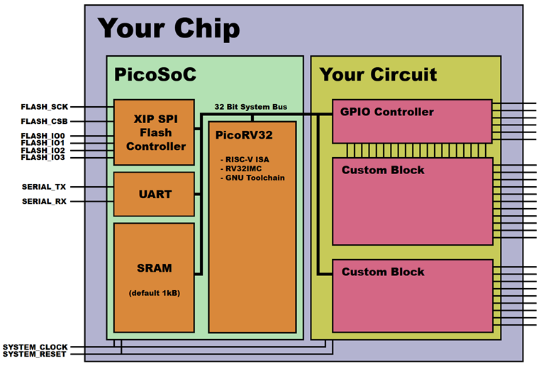

# 1. Tổng quan PicoSoC và vai trò của từng khối

PicoSoC là một thiết kế SoC mẫu xây quanh lõi PicoRV32. PicoSoC cho thấy
cách kết nối core CPU PicoRV32 với bộ nhớ, flash, UART và các ngoại vi
khác để thành một hệ thống có thể nạp lên FPGA và chạy firmware thực tế.

<table>
<colgroup>
<col style="width: 100%" />
</colgroup>
<thead>
<tr class="header">
<th>
<strong>Các khối cốt lõi của PicoSoC</strong>

<blockquote>

<strong>•</strong> PicoRV32 CPU: thực thi chương trình và phát sinh
truy cập bộ nhớ/peripheral.

<strong>•</strong> Internal SRAM: scratchpad nhỏ để chứa stack, biến
tạm và dữ liệu truy cập nhanh.

<strong>•</strong> spimemio + external SPI flash: nơi chứa firmware
chính và logic giúp CPU đọc flash như một vùng nhớ.

<strong>•</strong> UART: giao tiếp nối tiếp phục vụ debug, in thông
báo và nhận lệnh cơ bản.

<strong>•</strong> User peripheral region: khu vực để người thiết kế
mở rộng LED, GPIO, timer, custom IP, accelerator.

</blockquote></th>
</tr>
</thead>
<tbody>
</tbody>
</table>

## 1.1. Khối CPU

CPU trong PicoSoC là PicoRV32. Nó không truy cập ngoại vi bằng các lệnh
đặc biệt mà chỉ đọc/ghi vào các địa chỉ nhất định trong memory map. Phía
sau những địa chỉ đó là mạch giải mã để nối CPU đến SRAM, flash
controller, UART hay peripheral do người dùng thêm vào.

## 1.2. Khối SRAM 

SRAM trong PicoSoC có vai trò scratchpad (lưu trữ dữ liệu tạm ở vùng nhớ
nhỏ để xử lý nhanh). Dung lượng mặc định nhỏ, không nhằm thay thế hoàn
toàn cho bộ nhớ chương trình, mà để cung cấp nơi lưu stack và dữ liệu
tạm có tốc độ truy cập cao hơn flash.

## 1.3. Khối SPI flash và spimemio

Flash ngoài là nơi chứa firmware. Khối spimemio đóng vai trò cầu nối: nó
nhận truy cập bộ nhớ từ CPU, chuyển thành giao dịch SPI rồi trả dữ liệu
về. Nhờ đó CPU có thể đọc lệnh và dữ liệu trong flash gần giống như đang
đọc từ một vùng memory-mapped thông thường.

Một điểm đáng chú ý là spimemio không chỉ hỗ trợ kiểu đọc SPI đơn giản,
mà còn có thanh ghi cấu hình để chọn QSPI, DDR, continuous read mode và
số dummy cycles. Điều này cho phép tăng tốc truy cập flash.

## 1.4. Khối UART

UART là ngoại vi cơ bản nhưng rất hữu ích trong SoC. CPU chỉ cần ghi vào
thanh ghi data để gửi một byte, hoặc đọc từ thanh ghi đó để nhận byte
mới nhất. Đồng thời có một thanh ghi divider dùng để xác lập baud rate
theo clock hệ thống.

## 1.5. Vùng user peripherals

Phần địa chỉ từ 0x03000000 trở đi được dành cho các ngoại vi do người
dùng mở rộng. Đây là nơi rất thuận lợi để gắn LED, GPIO, timer, PWM hoặc
các khối tăng tốc mật mã. Trong ví dụ cho board iCE40-HX8K, 8 LED được
ánh xạ vào byte thấp của word tại địa chỉ 0x03000000.

# 2. Memory map, flash và cơ chế overlay

Memory map là cách SoC quy định mỗi dải địa chỉ thuộc về khối nào. Với
PicoSoC, tổ chức địa chỉ rất gọn nên nhìn vào memory map có thể suy ra
gần như toàn bộ luồng hoạt động của hệ thống.

**Bảng 1. Memory map chính của PicoSoC**

| **Dải địa chỉ**         | **Khối**                        | **Chức năng**                                                                                              |
|-------------------------|---------------------------------|------------------------------------------------------------------------------------------------------------|
| 0x00000000 – 0x00FFFFFF | Internal SRAM / vùng đầu bộ nhớ | SRAM nội bộ dung lượng nhỏ được overlay lên đầu không gian nhớ; dùng làm scratchpad, stack và dữ liệu tạm. |
| 0x01000000 – 0x01FFFFFF | External Serial Flash           | Ánh xạ trực tiếp bộ nhớ flash SPI ngoài; firmware chính thường nằm tại đây.                                |
| 0x02000000 – 0x02000003 | SPI Flash Config                | Thanh ghi cấu hình bộ điều khiển flash: MEMIO, QSPI, DDR, CRM, dummy cycles, bit-bang IO.                  |
| 0x02000004 – 0x02000007 | UART Divider                    | Thiết lập tần số baud bằng cách chia clock hệ thống.                                                       |
| 0x02000008 – 0x0200000B | UART Data                       | Ghi để gửi byte qua UART, đọc để nhận byte hoặc kiểm tra buffer nhận.                                      |
| 0x03000000 – 0xFFFFFFFF | User Peripherals                | Vùng ngoại vi do người thiết kế mở rộng: LED, GPIO, timer, custom accelerator, giao tiếp chuyên dụng.      |

## 2.1. Flash là gì?

Flash là bộ nhớ không mất dữ liệu khi tắt nguồn. Vì vậy firmware thường
được nạp vào flash, sau đó CPU sẽ đọc lệnh từ đây mỗi khi hệ thống
reset. Khác với SRAM, dữ liệu trong flash vẫn còn sau khi mất điện nên
rất phù hợp làm nơi chứa chương trình.

## 2.2. Overlay nghĩa là gì?

Overlay có thể hiểu là một vùng nhớ được đặt chồng lên trên vùng nhớ
khác trong cùng không gian địa chỉ. Cụ thể hơn, SRAM được overlay lên
đầu vùng flash. Vì thế khi CPU truy cập vào những địa chỉ đầu tiên, nó
sẽ nhìn thấy SRAM trước; chỉ khi vượt ra ngoài phần SRAM vật lý thì dữ
liệu mới được đọc từ flash ở địa chỉ tương ứng.

Cách tổ chức này giúp phần mềm có một vùng đầu bộ nhớ trông giống “main
memory”, trong đó phần nhỏ phía trước là SRAM nhanh và có thể ghi, còn
phần lớn phía sau là flash lớn hơn nhưng chậm hơn và chủ yếu dùng để
chứa chương trình.

# 3. Luồng boot và cách hệ thống vận hành

Khi hệ thống reset, PicoRV32 sẽ bắt đầu tại địa chỉ reset vector do
thiết kế quy định. Trong PicoSoC, firmware được đặt trong flash với
layout tương ứng để CPU có thể fetch lệnh ngay từ đầu quá trình khởi
động. Từ góc nhìn của CPU, nó chỉ đang đọc instruction từ một địa chỉ
nhớ; còn phía dưới là khối spimemio thực hiện toàn bộ giao dịch SPI với
flash.

> **•** Bước 1: nạp bitstream FPGA và image firmware.
>
> **•** Bước 2: reset hệ thống, CPU nhảy tới reset vector.
>
> **•** Bước 3: CPU fetch lệnh từ flash thông qua spimemio.
>
> **•** Bước 4: firmware khởi tạo stack, UART và các biến cần thiết.
>
> **•** Bước 5: chương trình chính chạy, điều khiển LED hoặc các
> peripheral memory-mapped khác.

Nếu cần tăng tốc flash, firmware có thể thiết lập cờ quad mode của chip
nhớ rồi bật cấu hình QSPI ở phía controller. Nhờ vậy có thể tổ chức SoC
một cách tối giản.

# 4. PicoRV32 - lõi xử lý bên trong PicoSoC

PicoRV32 là một lõi vi xử lý RISC-V 32-bit được tối ưu theo hướng nhỏ
gọn, dễ tích hợp và đạt tần số hoạt động cao trên FPGA. Thay vì hướng
tới CPI rất thấp như các bộ xử lý pipeline lớn, PicoRV32 chấp nhận hiệu
năng vừa phải để đổi lấy diện tích phần cứng nhỏ và khả năng đóng timing
tốt.

Lõi này có thể cấu hình để hỗ trợ các biến thể như RV32I, RV32IM,
RV32IC, RV32IMC hoặc RV32E. Điều đó cho phép người thiết kế lựa chọn
giữa mức độ đầy đủ của tập lệnh và lượng tài nguyên phần cứng sử dụng.
Chính sự linh hoạt này làm PicoRV32 phù hợp với các bài toán SoC học
thuật, hệ nhúng nhỏ và các thiết kế thử nghiệm tích hợp accelerator.

> **•** Không phải một SoC hoàn chỉnh; bản chất của PicoRV32 chỉ là CPU
> core.
>
> **•** Có thể dùng bus native đơn giản hoặc các biến thể AXI4-Lite,
> Wishbone.
>
> **•** Có sẵn cơ chế PCPI để mở rộng lệnh bằng đồng xử lý ngoài.
>
> **•** Có thể bật hệ thống ngắt đơn giản nhưng không hoàn toàn theo
> privileged ISA chuẩn của RISC-V.

# 5. Kiến trúc, giao tiếp và các cơ chế mở rộng của PicoRV32

## 5.1. Biến thể và các file quan trọng

Trong repository chính, file quan trọng nhất là picorv32.v. File này
chứa nhiều module như picorv32 (bản native), picorv32_axi, picorv32_wb
và các đồng xử lý PCPI cho nhân/chia. Vì vậy khi nghiên cứu kiến trúc
CPU, cần xem picorv32.v như trung tâm của toàn bộ dự án.

> **•** picorv32: lõi CPU dùng giao tiếp bộ nhớ native.
>
> **•** picorv32_axi: lõi CPU với AXI4-Lite master interface.
>
> **•** picorv32_wb: lõi CPU với Wishbone master interface.
>
> **•** picorv32_axi_adapter: cầu nối từ native interface sang
> AXI4-Lite.
>
> **•** picorv32_pcpi_mul / div: các ví dụ đồng xử lý qua PCPI.

## 5.2. Native memory interface

PicoRV32 dùng một giao tiếp valid-ready đơn giản để truy cập bộ nhớ. CPU
phát mem_valid khi có yêu cầu, phía bộ nhớ hoặc ngoại vi phản hồi bằng
mem_ready khi dữ liệu đã sẵn sàng hoặc thao tác ghi đã hoàn tất. Cách
làm này rất dễ dùng để tự viết decoder cho ROM, RAM, UART, GPIO hoặc các
ngoại vi tự thiết kế.

> **•** mem_addr: địa chỉ truy cập.
>
> **•** mem_wdata và mem_wstrb: dữ liệu ghi và byte-enable.
>
> **•** mem_rdata: dữ liệu đọc trả về.
>
> **•** mem_instr: phân biệt truy cập instruction fetch với truy cập dữ
> liệu.

## 5.3. PCPI và cơ chế mở rộng lệnh

PCPI (Pico Co-Processor Interface) là một điểm rất mạnh của PicoRV32.
Khi CPU gặp một lệnh không do lõi xử lý trực tiếp nhưng có hỗ trợ qua
PCPI, nó sẽ đưa instruction cùng các toán hạng nguồn ra interface này.
Đồng xử lý bên ngoài có thể nhận lệnh, tính toán rồi trả kết quả trở lại
cho CPU. Cơ chế đó đặc biệt phù hợp với các đề tài tích hợp bộ tăng tốc
AES, SHA3, Ascon hoặc các lệnh chuyên dụng do người thiết kế định nghĩa.

## 5.4. Hệ thống ngắt

PicoRV32 có hỗ trợ interrupt theo hướng tối giản. Thay vì bám sát toàn
bộ privileged architecture chuẩn của RISC-V, lõi này dùng các q-register
và một tập custom instruction để giảm overhead phần cứng. Điều này làm
thiết kế đơn giản hơn nhưng cũng có nghĩa là nó không hoàn toàn tương
thích với mọi phần mềm kỳ vọng môi trường machine-mode chuẩn.

# 6. Ưu điểm và hạn chế

## 6.1. Ưu điểm

> **•** Cách tổ chức bus và memory map đơn giản, dễ tự mở rộng ngoại vi.
>
> **•** Có thể chạy firmware từ flash mà không cần RAM lớn.
>
> **•** PicoRV32 hỗ trợ PCPI nên thuận lợi để tích hợp accelerator phần
> cứng.
>
> **•** Có sẵn ví dụ cho board FPGA thực tế và firmware mẫu.

## 6.2. Hạn chế

> **•** Interrupt của PicoRV32 mang tính tối giản, không hoàn toàn theo
> chuẩn privileged ISA đầy đủ.
>
> **•** PicoSoC là SoC mẫu tối giản, nên nếu muốn thành sản phẩm hoàn
> chỉnh vẫn phải bổ sung nhiều ngoại vi và kiểm soát hệ thống hơn.
>
> **•** Hiệu quả truy cập flash còn phụ thuộc loại chip nhớ và cấu hình
> cụ thể của spimemio.
